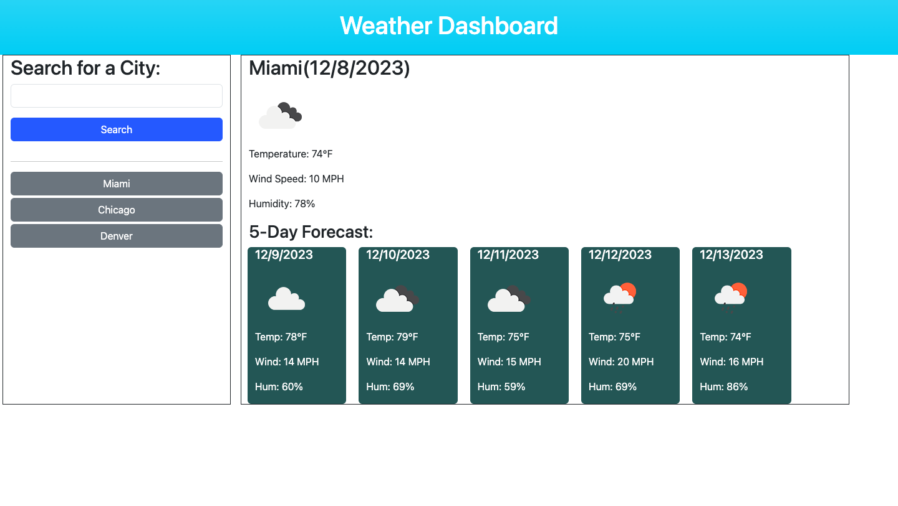

# Weather Dashboard : Third Party API

## Description

Look up your city's weekly forecast using the Weather Dashboard. In this app you can look up the current and future weather updates so that you can prepare for the work week ahead. Explore app: https://rujainemena.github.io/weather-dashboard/

## Table of Contents 
  - [Usage](#usage)
  - [License](#license)
  - [Contributions](#contributions)
  - [Test](#test)

## Usage

This application uses a third-party API from the [5 Day Weather Forecast](https://openweathermap.org/forecast5) to retrieve current and future weather data for cities in the United States.  

## Features

## License

## Contributions

N/A

## Test
